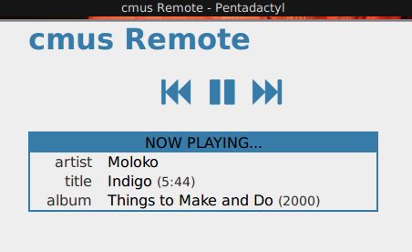

cmus-remote
===========

Description
-----------

cmus-remote small Flask app that acts as a remote control for C*mus. It
shows the current playing tracks, as well as allowing the user to play,
pause or skip tracks. As a Python app, it contains the `backend.py`
file, which can be imported in a different Python script.

The motivation to write this was to learn Python classes, interfacing to
sockets, and developing a small Flask application that could be deployed
to my Raspberry Pi (which is the machine running our favorite music
player).

This is a recent screenshot. Note that I'm not a UI designer as you can
see:

Installation
------------

0. Requirements:

    - Python
    - Flask
    - Werkzeug
    - Jinja2

1. Clone this repo to the destination of your choosing.

2. Customise `frontend.py` according to your taste:

    - Cmus() takes a `user` parameter, which is the user that is running
    C*mus. Note that you need write access to talk to the socket.
    
    - If you call the app from within a python interpreter, it will
    listen on the port specified in the last line of the file.
    
3. Run the application:

    - from an WSGI service such as UWSGI.

    - from a python interpreter.

License
-------

This app is uncopyrighted. Feel free to do with it whatever you please.
I am still a Python newbie so please send corrections or pull requests.
